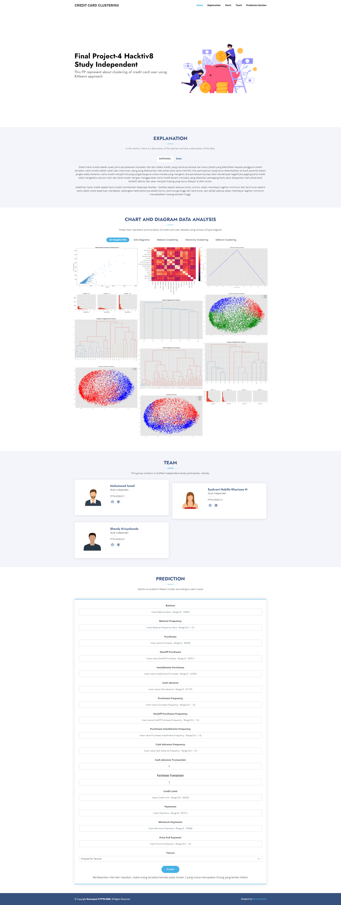
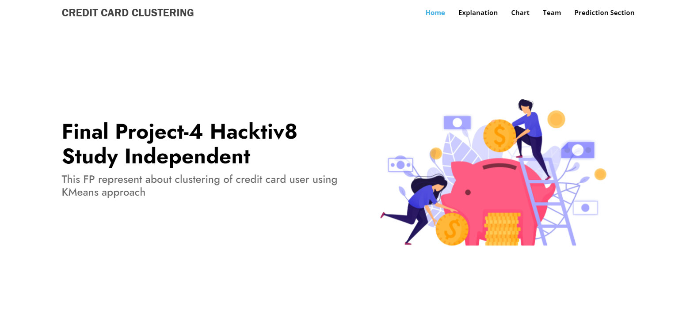
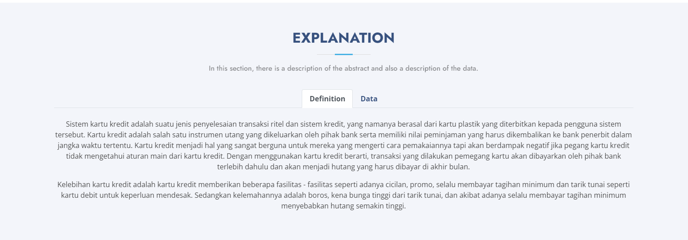
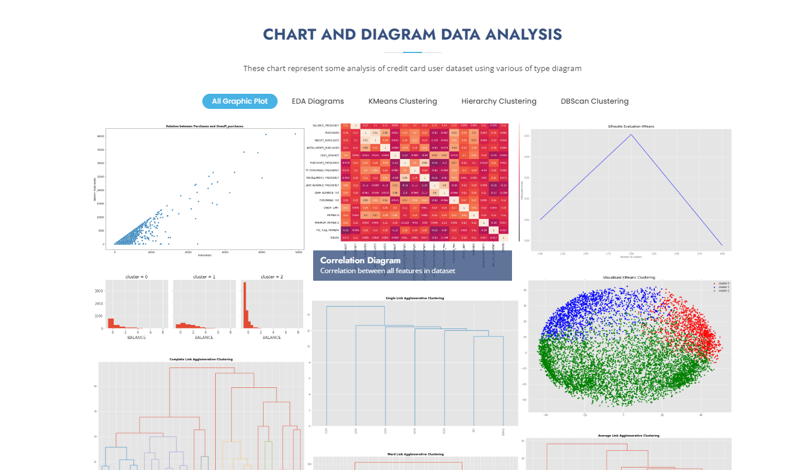
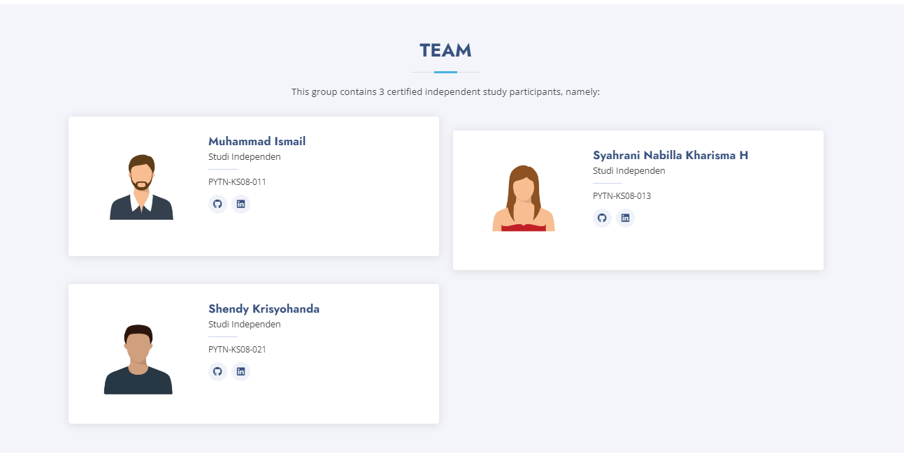
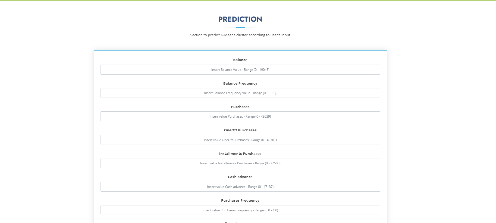

# Final Project 4 - Clustering

## Latar Belakang  

Kasus ini membutuhkan untuk mengembangkan segmentasi pelanggan untuk menentukan strategi pemasaran. Ini sample Dataset yang merangkum perilaku penggunaan sekitar 9000 pemegang kartu kredit aktif selama 6 bulan terakhir. 

Menggunakan Dataset <a href="https://www.kaggle.com/arjunbhasin2013/ccdata">Credit Card Dataset for Clustering</a>

## Objektif

Final Project 4 ini dibuat guna mengevaluasi konsep Clustering sebagai berikut:
- Mampu memahami konsep Clustering dengan menggunakan Scikit-Learn
- Mampu mempersiapkan data untuk digunakan dalam Clustering
- Mampu mengimplementasikan Clustering pada data yang diberikan

## Ulasan Proyek

Data ini berisi transaksi pengguna kartu kredit sebanyak 9000 orang selama 6 bulan. Data ini memiliki 18 atribut.

## Informasi Atribut

1. `CUSTID` - **Identification of Credit Card holder (Categorical)**
2. `BALANCE` - **Balance amount left in their account to make purchases**
3. `BALANCEFREQUENCY` - **How frequently the Balance is updated, score between 0 and 1 (1 = frequently updated, 0 = not frequently updated)**
4. `PURCHASES` - **Amount of purchases made from account**
5. `ONEOFFPURCHASES` - **Maximum purchase amount done in one-go**
6. `INSTALLMENTSPURCHASES` - **Amount of purchase done in installment**
7. `CASHADVANCE` - **Cash in advance given by the user**
8. `PURCHASESFREQUENCY` - **How frequently the Purchases are being made, score between 0 and 1 (1 = frequently purchased, 0 = not frequently purchased)**
9. `ONEOFFPURCHASESFREQUENCY` - **How frequently Purchases are happening in one-go (1 = frequently purchased, 0 = not frequently purchased)**
10. `PURCHASESINSTALLMENTSFREQUENCY` - **How frequently purchases in installments are being done (1 = frequently done, 0 = not frequently done)**
11. `CASHADVANCEFREQUENCY` - **How frequently the cash in advance being paid**
12. `CASHADVANCETRX` - **Number of Transactions made with "Cash in Advance"**
13. `PURCHASESTRX` - **Number of purchase transactions made**
14. `CREDITLIMIT` - **Limit of Credit Card for user**
15. `PAYMENTS` - **Amount of Payment done by user**
16. `MINIMUM_PAYMENTS` - **Minimum amount of payments made by user**
17. `PRCFULLPAYMENT` - **Percent of full payment paid by user**
18. `TENURE` - **Tenure of credit card service for user**

## Menjalankan Website 
1. Make Folder `Final Project 4`
2. Make environment variable with command `python -m venv venv` in cmd prompt
3. Download this repository
4. Move folder `model, static, templates` and file `app.py and requirement.txt` into `Final Project 4`
5. Activate environment with `venv/Scripts/activate` with cmd prompt
6. After activated, type this `pip install -r requirements.txt`
7. Type this `$env:FLASK_APP="app.py"` and then `flask run`  

## Tampilan Website

- Tampilan Secara Keseluruhan

- Tampilan Home

- Tampilan Explanation 

- Tampilan Chart

- Tampilan Team

- Tampilan Prediction Section
